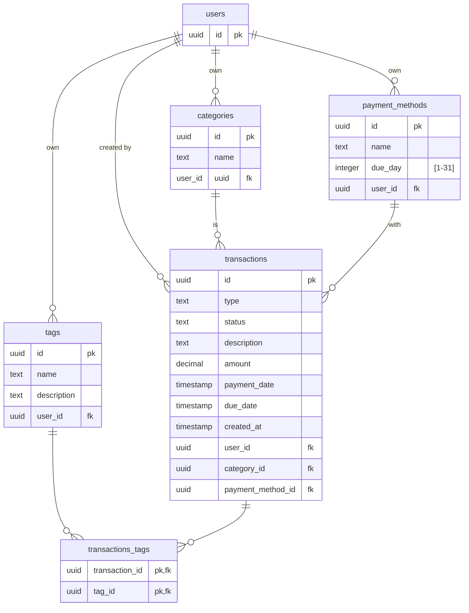

```mermaid
erDiagram
    users {
        uuid id pk
    }

    tags {
        uuid id pk
        text name
        text description
        uuid user_id fk
    }

    transactions_tags {
        uuid transaction_id pk,fk
        uuid tag_id pk,fk
    }

    categories {
        uuid id pk
        text name
        user_id uuid fk
    }

    payment_methods {
        uuid id pk
        text name
        integer due_day "[1-31]" 
        uuid user_id fk
    }

    transactions {
        uuid id pk
        text type
        text status
        text description
        decimal amount
        timestamp payment_date
        timestamp due_date
        timestamp created_at
        uuid user_id fk
        uuid category_id fk
        uuid payment_method_id fk
    }

    users ||--o{ tags : "own"
    users ||--o{ categories : "own"
    users ||--o{ payment_methods : "own"
    users ||--o{ transactions : "created by"

    tags ||--o{ transactions_tags : ""

    transactions ||--o{ transactions_tags : ""

    categories ||--o{ transactions : "is"

    payment_methods ||--o{ transactions : "with"

```